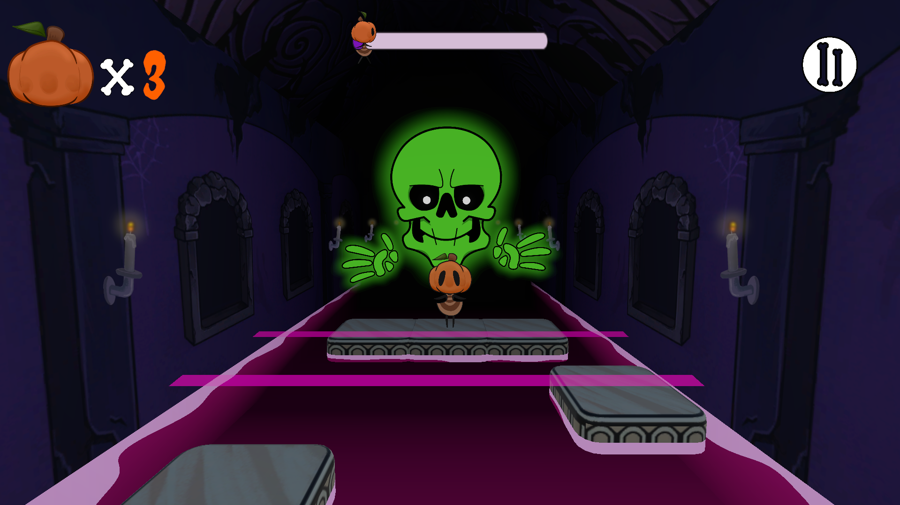

# La nascita del Team Oro

Quest'anno alla Nautilus Academy, dove studio Gamedevelopment, si sta rivelando più tumultuoso del previsto, soprattutto per le mie grandi difficoltà nel riuscire a bilanciare studio, lavoro e quel minimo di vita privata che vorrei ancora avere.  
Una cosa davvero interessante di questo terzo anno è che, volente o nolente, non sono mai solo, poiché ogni singolo progetto che sviluppiamo sarà un progetto di gruppo. E proprio dall'unione di un gruppo di giovani e brillanti menti è nato il **Team Oro**, destinato ovviamente a scontarsi con il Team Argento (a rimandare a dei tempi nei quali i giochi Pokémon non facevano ancora schifo).  
Avevamo quattro settimane per realizzare un nuovo progetto. Mentre tutti gli artisti avevano delle limitazioni stilistiche, noi sviluppatori avevamo ovviamente delle limitazioni a livello di meccaniche e gameplai. Nello specifico:

- Dovevamo realizzare un gioco per Android
- Il gioco doveva essere necessariamente un rhythm game
- Il gioco sarebbe dovuto diventare sempre più caotico 

Proprio sotto tali premesse, dopo quattro settimane di lacrime e fatica, è venuto alla luce  **Trick or Beats**.

---

# Trick or Beats

Per farla breve, si tratta di un gioco ritmico dove, nei panni di una piccola zucca, bisognerà scappare da uno scheletro fantasma saltando tra una serie di piattaforme a ritmo di musica.
Un concept anche abbastanza semplice, ma che riesce comunque a risultare divertente e immediato.  
La cosa di cui vado più fiero è senza dubbio il comparto estetico, questo grazie all'ottimo lavoro svolto dai ragazzi che si sono occupati dei disegni.  
Se vi state chiedendo del perché il gioco abbia questo stile creepy, beh semplicemente perché si stava avvicinando Halloween, e avevamo voglia di fare qualcosa a tema.  
Ovviamente non si tratta di un gioco perfetto o finito, ma solo di una demo che abbiamo sviluppato in poche settimane, e che, avendone il tempo, saremo anche felici di poter finire e migliorare.  

---

# Download
Se vi va di provare il gioco, potete farlo gratuitamente da qui. Altrimenti, potete visitare direttamente la mia pagina itch.io!  
Spero sinceramente che il gioco vi piaccia, e in tal caso vi invito a lasciare una recensione, così da aiutarci a migliorare il gioco e noi stessi come sviluppatori.

<iframe frameborder="0" src="https://itch.io/embed/3976300?border_width=0&amp;bg_color=1D1339&amp;fg_color=47B025&amp;link_color=47B025&amp;border_color=1D1339" width="550" height="165"><a href="https://erym03.itch.io/trick-or-beat">Trick or Beat by erym03</a></iframe>

